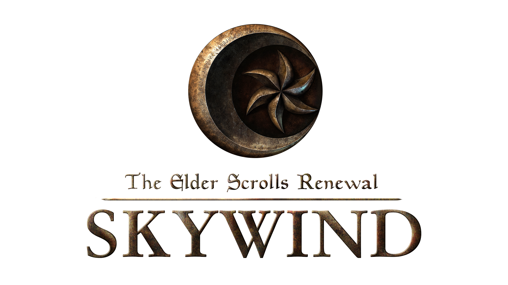
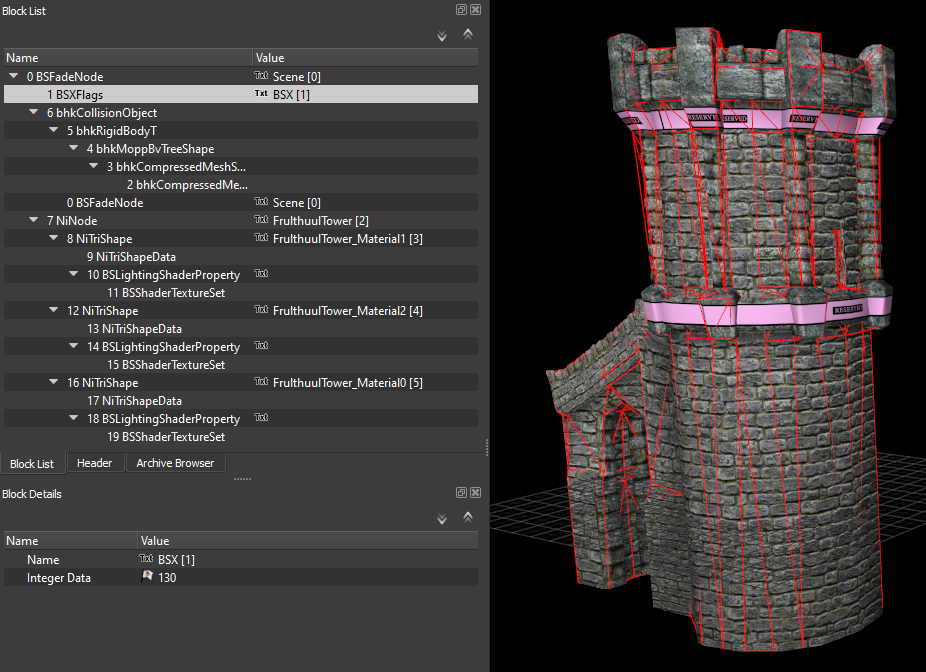
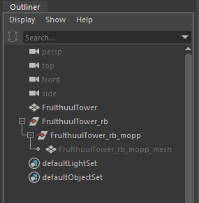
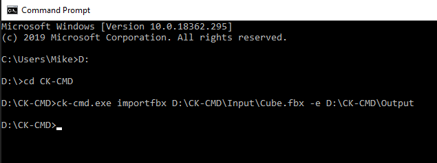
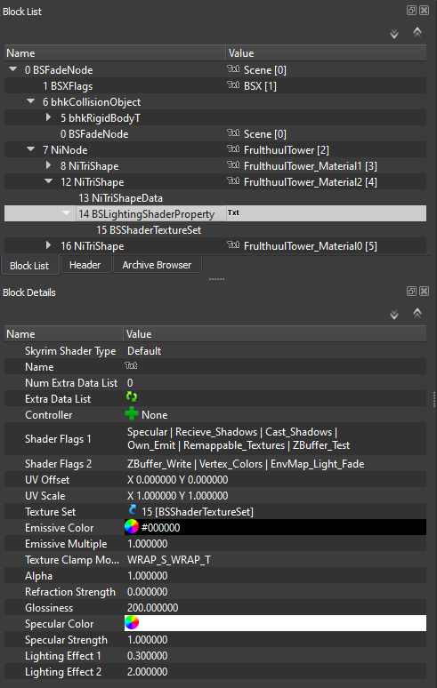

# ck-cmd

[](https://ci.appveyor.com/project/SpectralPlatypus/ck-cmd)

Command line helper for executing some Creation Kit/Engine commands. Based upon hkxcmd project by Figment,
available at https://github.com/figment/hkxcmd

ck-cmd was born to support the effort of [Skywind](https://tesrskywind.com)'s artists and developed for all of TES games modding communities.




## Introduction

ck-cmd is a command prompt application that can convert fbx files into nif files for use in appropriate game engines. This makes is software-agnostic unlike most exporter plugin solutions, and it is not easily affected by version changes in the modeling software used for exporting the fbx. Essentially, it makes it possible to export a finished asset as an fbx from nearly any modeling software, and create a nif file that is 95% ready for game import with only one command. 

It properly transfers vertex coloring to nif files from an fbx, which was previously only possible with very specific plugin and software combinations. Models are automatically split by material ID and materials settings and paths are translated from modeling software to BSLightingShaderProperty nodes. It also applies all necessary strings, flags, and values in the resulting nif. Visual adjustments may be desired through nifskope, but if properly prepared, the resulting nif is game-ready.

|  | 
|:--:| 
| *Resulting nif file before any adjustment, including collision and vertex coloring, created from an exported FBX asset. This example asset is unfinished, but the nif could already be successfully used in-engine.* |

## ck-cmd Preparation:

- No special considerations need to be made for where ck-cmd is located on your computer, but commands include file paths, so it may be advisable to place it somewhere with a short and simple path. It is convenient to create a common folder for fbx input and nif output, as in the example:

D:\CK-CMD\
    > Input\
    > Output\

## Model Preparation: 

- Ensure all faces have the intended materials applied, as ck-cmd will create BSLightingShaderProperty nodes with any applicable materials in the FBX. Note that some material shaders do not translate correctly to BSLightingShaderProperty nodes, so check this first if the generated BSLightingShaderProperty nodes have issues. Standard blinn materials are recommended. 

- The application will also use the same file paths as your 3D software’s material shaders, meaning that if you set up materials with the textures already in their proper end-user location in \Data\Textures, you may not need to change the paths in the nif later.

- Assets should be combined into a single object, as ck-cmd will automatically create multiple NiTriShapes to match the materials assigned to faces of the mesh. 

- It is not necessary to flip or change export settings to compensate for Z-up vs Y-up modeling software.

- The name of your mesh or submeshes in your software’s outliner (or specific term for object heirarchy) will be used to create strings in the nif.

- The other usual pre-export checks apply (freeze any transformations, check pivot/origin, apply any modifiers, etc).

- The application will properly transfer any vertex coloring to the resulting nif. (Note however that in some modeling software, using vertex colors on some nodes but not otherwise leads to strange results when converted. Consequently, you may need to flood your model with the default white color before vertex painting shadow areas.)

- If your nif is to include a collision mesh (see below), it does not need to have any materials applied, should be a single object, and should be pre-export checked as in the previous step.

## Scale Matching:

Different modeling software will have different default settings for the meaning of one measurement unit. When your asset is correctly scaled for its intended in-game size in comparison to the grid or even other exported Skyrim assets, it may import into Nifskope with a different per-unit measurement, and the engine reading the nif could interpret an intended scale of five meters as five centimeters, or vice versa. This problem is almost always a matter of centimeters versus meters, so check this first if your asset looks about 100 times larger or smaller than intended.

(This is unlikely to affect Blender with default settings. In Maya, it is necessary to set the scale of the grid to meters, instead of the default centimeters, then export the fbx with the Units dropdown changed to no automatic scaling, and file units converted to centimeters. This is a matter of Maya to game engine workflow, not specific to ck-cmd.)

## Including a Collision Mesh:

To include a collision mesh, arrange your outliner/hierarchy like so before exporting it all as a single FBX:
Paragraph:

- **MyAssetName** (visual model)
- MyAssetName_rb
  - MyAssetName_rb_mopp
    - **MyAssetName_rb_mopp_mesh** (collision model)

Text highlighted refers to meshes, while the intermediary hierarchy objects are empty (groups or another term your specific modeling software uses).

|  | 
|:--:| 
| *Example hierarchy from Maya with collision mesh.* |

## Converting FBX to Nif:

1. Open the command prompt.
2. Navigate to CK-Cmd’s location.
3. Use the command:    ck-cmd.exe importfbx (full input path\Example.fbx) -e (full output path)
4. Wait for the process to finish.
5. Open the resulting nif in nifskope for inspection. It is generated in the output location with the same name as the fbx file originally used for input.

|  | 
|:--:| 
| *Example command prompt window after normal use.* |

## Adjustments in Nifskope:

Ck-cmd should have created a nif file with all basic setup complete, such as strings, BSX flags, collision meshes, etc. 

- It should have also divided your model into NiTriShapes by material ID, and approximated your material shader settings in the resulting BSLightingShaderProperty nodes. 

- If your asset appears untextured (bright magenta in color), you will need to direct nifskope to the proper texture paths. 

- You will still need to adjust visuals via BSLightingShaderProperty settings that are not present in your default modeling software’s materials, such as the global glossiness value, switching shader types, adding shader flags such as emission or environment mapping, etc, as well as other arbitrary settings in the nif, such as audio material settings.

|  | 
|:--:| 
| *SLightingShaderProperty nodes may require adjustments to visual taste after nif conversion.* |


## Building from sources

Requires CMake to be built.
##### Cloning the repo
```console
git clone https://github.com/aerisarn/ck-cmd.git ck-cmd
cd ck-cmd
```
##### Downloading modules: 
```console
git submodule update --init --recursive
```
##### Downloading libraries: 
Put all the libraries into ``rootDir/lib``
The required libraries are:
- bsa : [GitHub](https://github.com/Ortham/libbsa "GitHub")
- DirectXTex : [GitHub](https://github.com/Microsoft/DirectXTex/tree/master/DirectXTex "GitHub")
- fbx : [GitHub](https://github.com/jskorepa/fbx/tree/master/src "GitHub")
- loadorder : 
- loki : [Website](http://loki-lib.sourceforge.net/index.php?n=Main.Download "Website")
- nif : [GitHub](https://github.com/niftools/niflib "GitHub")
- xedit : [GitHub](https://github.com/matortheeternal/xedit-lib "GitHub")
- zlib : [GitHub](https://github.com/TES5Edit/TES5Edit/tree/dev/zlib "GitHub")

The expected file structure is [here](https://privatebin.net/?103e41356959809a#WAHHYkhZyGOV7c5tCmpaEHTzm1b458Z9KHWzjpVv5Vo= "here").

##### Running CMake:
```console
mkdir build
cd build
cmake -G "Visual Studio 15 2017" -A Win32 ..
```
Then use Visual studio to build the generated ck-cmd solutions (ck-cmd.sln)
